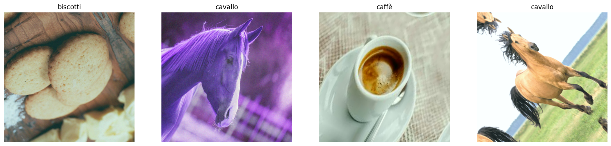
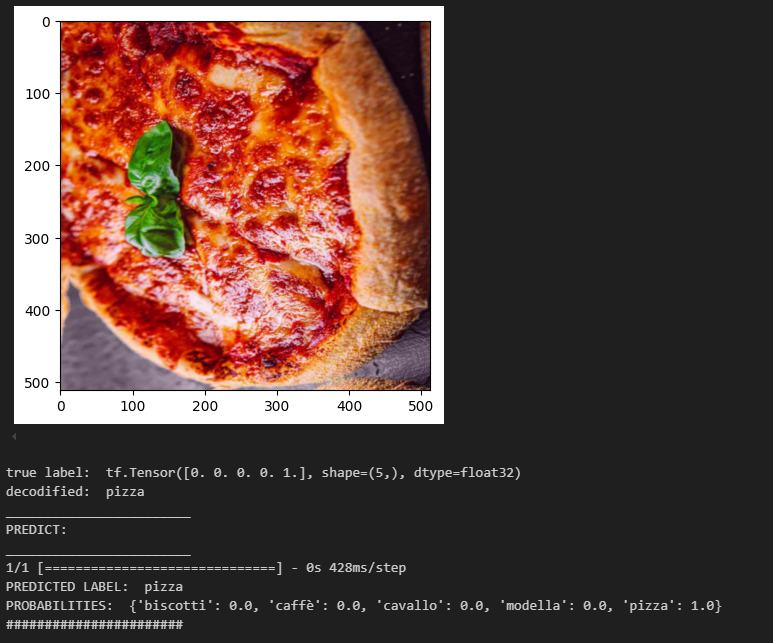

# Custom Image Classificator

This repository allows users to train models on their own images to recognize any desired classes.

It was developed with the goal of building a robust model, featuring custom loss functions and a wide range of augmentation techniques.

#### Dataset example:

#### Prediction example:

